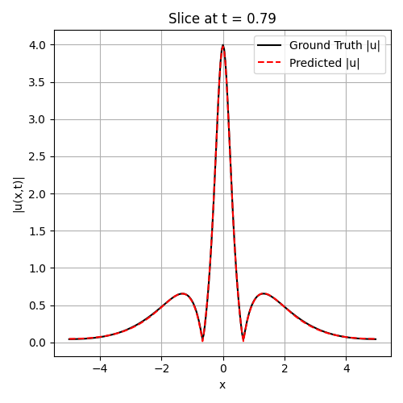

# Nonlinear Schrödinger Equation (NLS)

## Background

The Nonlinear Schrödinger Equation is a classical field equation
that is used to study quantum mechanical systems. It is primarily used to study propagation of light in optical fibers and Bose-Einstein condensates. The NLS equation we use (from Raissi _et al._ (2019)),

$$i h_t + 0.5h_{xx} + |h|^2 h = 0$$
with periodic boundary conditions,
$$
x \in [-5,\,5], \qquad t \in \left[0,\,\frac{\pi}{2}\right], \tag{5}
$$

$$
h(x,0) = 2\,\mathrm{sech}(x),
$$

$$
h(-5,t) = h(t,5),
$$

$$
h_x(-5,t) = h_x(t,5).
$$

Notice that our state variable $h(x,t)$ is an imaginary number. Thus, we need to handle both real and imaginary parts.

## Model

We use Tensorflow in Python for implementations.

The test set used: [Link to test set](https://github.com/maziarraissi/PINNs/blob/master/main/Data/NLS.mat)  
We use relative $L_2$ error.

In my [Burgers' PDE implementation](https://github.com/aadharsh06/pinn/tree/main/models/Burgers_PDE)  I talked about how I integrated L-BFGS into my code. We use the same technique here as well.

Architecture and hyperparameters used:

* 5 Hidden layers, 100 neurons each, with $tanh$ activation.
* Max iterations = 50,000 for L-BFGS. No gradient tolerance set.
* 20,000 collocation points along with 20,000 seperate boundary + 20,000 initial enforcement points.
* The final layer has two neurons: One for the real part and one for the imaginary part.

While I did define an Adam optimizer in my code as well, in practice I found pure L-BFGS to converge much better than using a prior Adam optimizer, thus in the final code `adam_epochs` is set to zero.

## Results

Note the results shown here are of the best/latest implementation. Corresponding weights for this model are stored in `latest.weights.h5`

**Test set error**: 0.007236 (or $7.2 \times 10^{-3}$)

Other observations/results:

* Even though L-BFGS `max_iterations = 50000`, it stopped early, before 15,000 function calls. (Function calls is defined in `nls_train.py`
* Time taken for training: 2617.038 seconds (≈43.6 minutes). Note, a P100 GPU was used.
* Final training losses:\
MSE_o: 1.398e-05 (initial condition loss)\
MSE_b: 3.968e-05 (boundary condition loss)\
MSE_f: 6.353e-05 (collocation points loss)

## Plots

